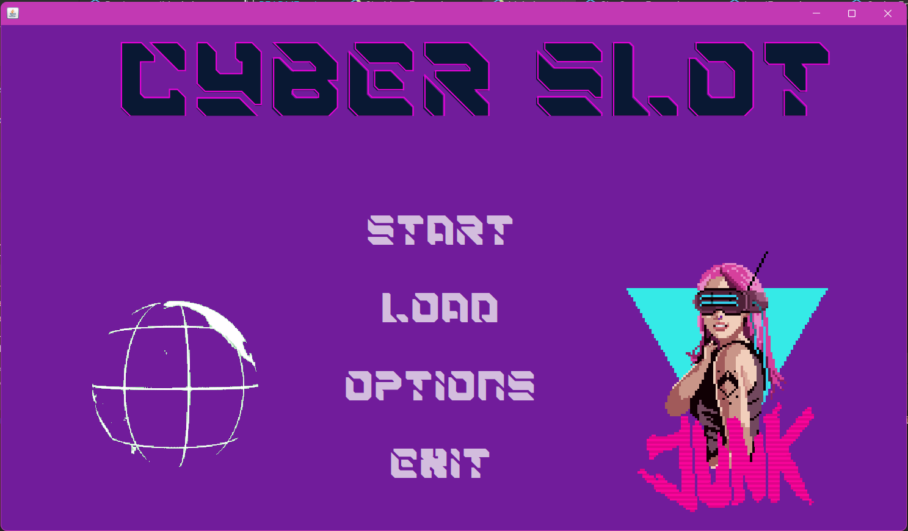
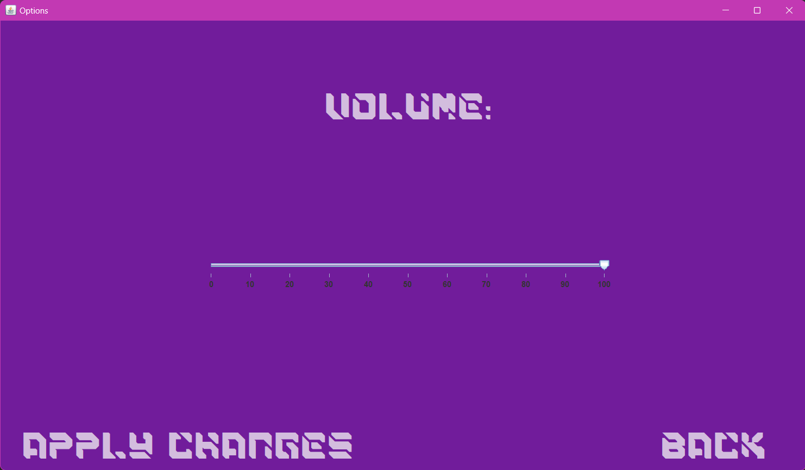
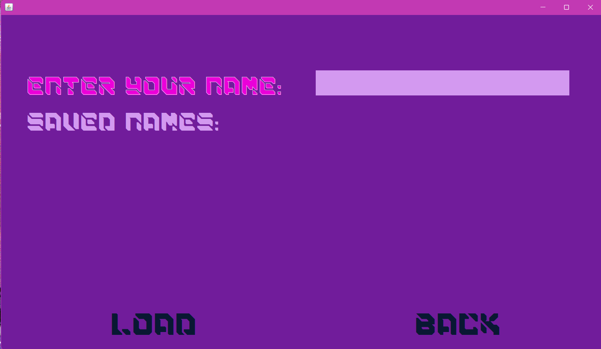
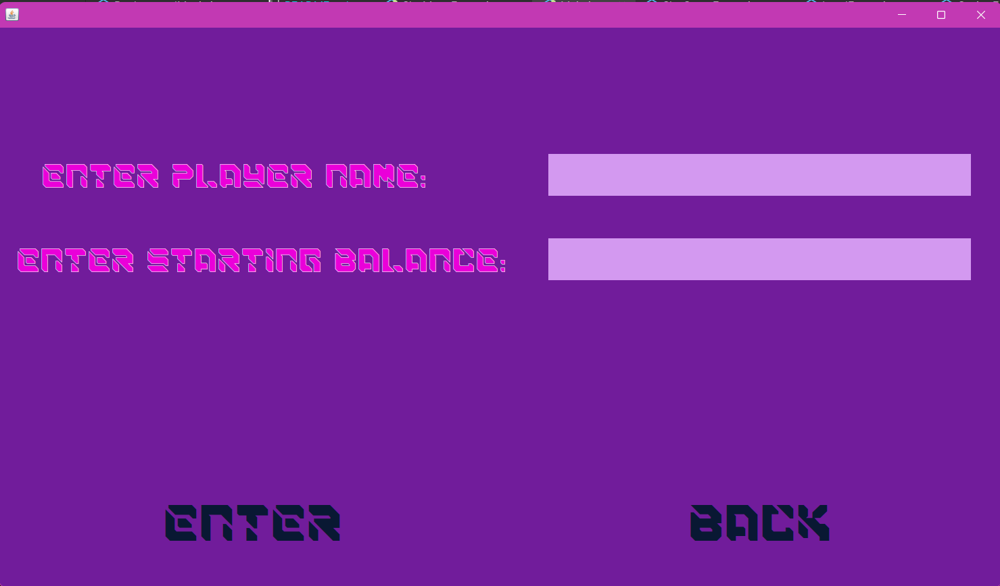
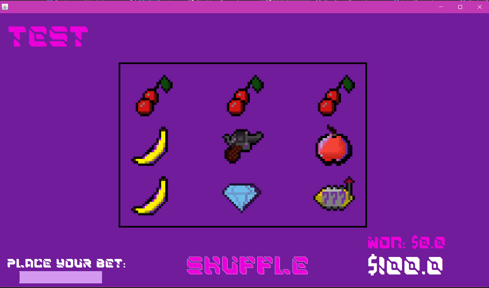

# Slot Machine Game 🎰

## Overview 📖

The Slot Machine Game is a Java-based application that simulates a virtual slot machine. It is designed to provide users with an engaging and entertaining experience of playing a slot game. The project incorporates sound effects, customizable options, and an intuitive user interface.


## Features 📜

- **Slot Machine Simulation**: Experience the thrill of a slot machine with graphical representation.
- **Options Menu**: Customize the game settings, including background music volume.
- **User-Friendly Interface**: Intuitive design for an enjoyable gaming experience.

## How to Play 🧮

1. Launch the game.
2. Adjust game options through the "Options" menu.
3. Start the game, write you name and add your balance, and enjoy the slot machine simulation.


## System Requirements ⚙️

- Java Runtime Environment (JRE) installed on the system.


## Run Locally 🥁
1. Clone the repository to your local machine.
   ```bash
   git clone https://github.com/kosa12/SlotMachine.git

2. Navigate to the project directory.
    ```bash
    cd SlotMachine

3. Compile and run the application.
    ```bash
    javac Main.java
    java Main\
   
## Screenshots 📸
**Menu window**


**Option window**


**Load window**


**Save window**


**Game window**

   
## Badges
[](https://choosealicense.com/licenses/mit/)


